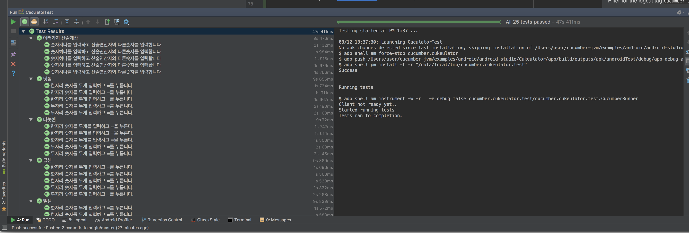
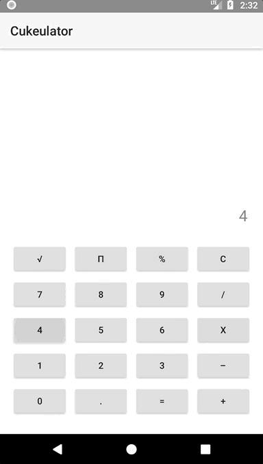

## Cukeulator Korean Example Test

이 프로젝트는 cucumber-jvm의 android example을 기초로 하여 Cucumber를 한국어 버전으로 변형시킨 프로젝트입니다.

This project based On [cucuber-jvm](https://github.com/cucumber/cucumber-jvm) android example.
 
This is the example test-project for the Cukeulator app for Android Studio 3.0+


### Setup
Features must be placed in `assets/features/`. Subdirectories are allowed.

The rest of the dependencies are added automatically in `app/build.gradle`.

The cucumber-android dependency is added as (see `app/build.gradle`):

```
androidTestCompile 'io.cucumber:cucumber-android:<version>'
```

### Using gradle

To build the test apk:

```
cd cucumber-jvm/examples/android/android-studio/Cukeulator

./gradlew --parallel :app:assembleDebugTest
```

The build generates an apk in app/build/outputs/apk/app-debug.apk.

To install the apk on a device:

```
adb install -r app/build/outputs/apk/app-debug.apk
```

To verify that the test is installed, run:

```
adb shell pm list instrumentation
```

The command output should display;

```
instrumentation:cucumber.cukeulator.test/cucumber.api.android.CucumberInstrumentation (target=cucumber.cukeulator)
```

To run the test:

```
cd cucumber-jvm/examples/android/android-studio/Cukeulator;
./gradlew connectedCheck
```

As an alternative option, the test can be run with adb:

```
adb shell am instrument -w cucumber.cukeulator.test/cucumber.cukeulator.test.Instrumentation
```

### Using an Android Studio IDE
1. Import the example to Android Studio: `File > Import Project`.
2. Create a test run configuration:
    1. Run > Edit Configurations
    2. Click `+` button and select Android Tests
    3. Specify test name: `CalculatorTest`
    4. Select module: `app`
    5. Enter a Specific instrumentation runner: `cucumber.cukeulator.test.Instrumentation`
    6. Click Ok
    7. Start Run
   		 
   		 
    8. The emulator would be run your tests.

	    

### Output
Filter for the logcat tag `cucumber-android` in [DDMS](https://developer.android.com/tools/debugging/ddms.html).

You can see the sample in [cucumber.html](cucumber.html/index.html)


### Using this project with locally built Cucumber-JVM
See [app/build.gradle](app/build.gradle) under `dependencies`.  
There is a source-code comment which explains how to use a locally built Cucumber-JVM Android library.